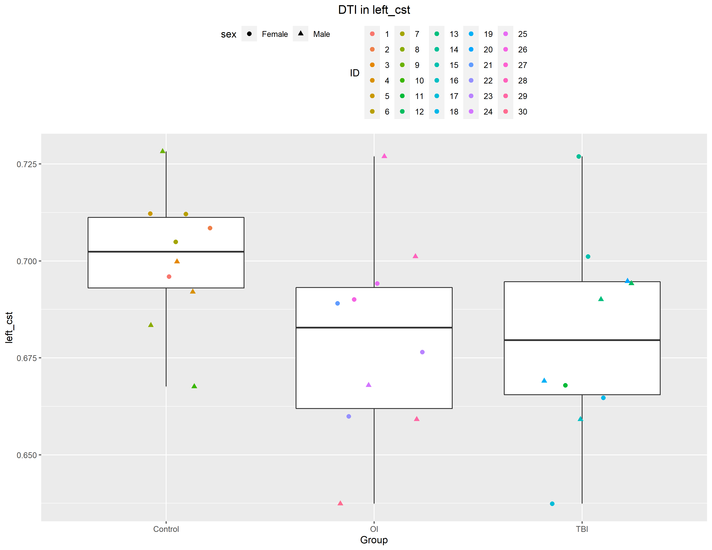
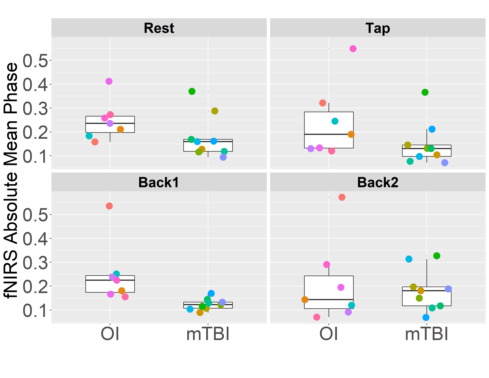

```{r setup, include=FALSE, cache=FALSE, echo=FALSE}
if (!require("pacman")) install.packages("pacman")      # Check to see if pacman is installed, otherwise load it
pacman::p_load(apastats, tidyverse, officedown, officer) # Loading packages we need to knit the document

knitr::opts_chunk$set(fig.cap = TRUE,           # Do you want your figures to have captions?
                      fig.path = 'images/',     # The path to your images
                      echo = FALSE,             # Do you want the code to be echoed?
                      warning = FALSE,          # Do you want warnings to be displayed?
                      message = FALSE,
                      include = TRUE,           # Do you want code chunks to be included?
                      dpi = 300,                # Resolution of your images (if not pre-rendered)
                      crop = TRUE # This will remove the whitespace surrounding an image see here: https://bookdown.org/yihui/rmarkdown-cookbook/crop-plot.html
                      )

# Start loading data into the environment
load("data/analyzedData.RData")                # Load our saved data
use_betterbiblatex = TRUE
```

# Table of content

<!---BLOCK_TOC--->

\newpage

## List of figures

<!---BLOCK_TOC{seq_id: 'fig'}--->

## List of tables

<!---BLOCK_TOC{seq_id: 'tab'}--->

\pagebreak

::: {custom-style="Article Title"}
Sample manuscript showing style and formatting specifications for *Journal of Biomedical Optics and Neurophotonics* journal papers
:::

::: {custom-style="Author Names"}
First Author,^a^ Second Author,^a^ Third Author,^b^ Fourth Author^a,b,\*^
:::


::: {custom-style="Author Affiliations"}
^a^ University Name, Faculty Group, Department, City, Country

^b^ Company Name, City, Country
:::

`r officer::run_linebreak()`

\newpage

# Introduction

Your introduction is going to include citations. You can include one citation [@lapointe2018] or several citations [@lapointe2018; @vlisides2019].

## Use of This Template
Authors may use this Microsoft (MS) Word template by employing the relevant styles from the Styles and Formatting list (which is accessed from the Styles group in the Home ribbon). To view which style is being used in any part of this document, place the cursor on the line and look in the style list Figure \@ref(fig:figure1))


```{r figure1, fig.cap = "MS Word 2010 Home ribbon. Red arrow indicates where to access Styles window.", fig.asp=2550/3300, fig.height=6.5}
knitr::include_graphics("images/figure1.png")
```


# Results

There was a significant effect of "Group" on the average test score `r describe.aov(model, "Group")`. Descriptive statistics were run and are shown in Table \@ref(tab:tbl-demo) below

```{r tab.id="tbl-demo", tab.cap="Descriptives"}
tbl.demo
```

A plot is shown in Figure \@ref(fig:myFigure1)

```{r myFigure1, fig.cap = "Caption for my Figure", fig.asp=2550/3300, fig.height=6.5}

```
Its common to want to use "landscape" pages in order to fit a larger image. Below I show an example 


<!---BLOCK_LANDSCAPE_START--->

```{r fig.id="CohMeanAllTasks", fig.cap="Changes in Coherence over all Tasks in L-DLPFC/R-DLPFC. Significant group differences were noted in the Rest and 2-Back tasks", fig.width=7.4, fig.asp=2250/3300}
# aspect ratio must be 0.7705882352941176

```
<!---BLOCK_LANDSCAPE_STOP--->


# Discussion

Insert your discussion here

\newpage

# Appendix

Below I show some other common tricks you can accomplish in RMarkdown. You can view the [RMarkdown cheatsheet](https://rstudio.com/wp-content/uploads/2015/02/rmarkdown-cheatsheet.pdf) for more information


Text formatting 
------------------------------------------------------------

*italic*  or _italic_
**bold**   __bold__
`code`
superscript^2^ and subscript~2~

Headings
------------------------------------------------------------

# 1st Level Header

## 2nd Level Header

### 3rd Level Header

Lists
------------------------------------------------------------

*   Bulleted list item 1

*   Item 2

    * Item 2a

    * Item 2b

1.  Numbered Item 1. The numbers are incremented automatically in the output.
    +   Sub-item 1A
2.  Numbered Item 2
    +   Sub-item 2A
    +   Sub-item 2B
1.  Numbered list item 1


[linked phrase](http://example.com)


## Random Symbols I can use

You can render emojis in RMarkdown. Here are some examples.

✅ Correct/Checkmark `r officer::run_linebreak()` ❌ Incorrect sign `r officer::run_linebreak()` 🧠 Brain `r officer::run_linebreak()` 📚 Books `r officer::run_linebreak()` ∵ == because `r officer::run_linebreak()`

\newpage

# References